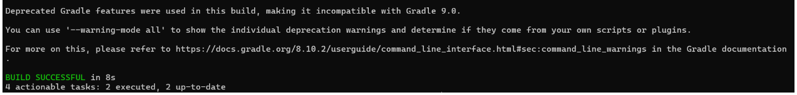

# Weather REST API Spring Boot & Java

## Descripción

Este proyecto es una API REST desarrollada con Spring Boot que consulta datos meteorológicos de la API de [OpenWeatherMap](https://openweathermap.org/). La API recibe la latitud y longitud del lugar, y devuelve información sobre la temperatura y la humedad.

## Componentes principales:

1. **Controlador (WeatherReportController)**: Maneja las solicitudes HTTP y delega la lógica de negocio al servicio.
2. **Servicio (WeatherReportService)**: Se encarga de hacer las solicitudes a la API de OpenWeatherMap y procesar las respuestas.
3. **Cliente HTTP (RestTemplate)**: Utilizado por el servicio para hacer las solicitudes a la API externa.

## Prerrequisitos

Debes tener las siguientes herramientas instaladas y configuradas en tu sistema:

1. **Java 17**
   Verifica que Java esté instalado con el comando:
   ```bash
   java -version
   ```
   Deberias obtener algo similar a:
   ```bash
   java version "17.0.1"
   Java(TM) SE Runtime Environment (build 17.0.1+12-LTS-39)
   Java HotSpot(TM) 64-Bit Server VM (build 17.0.1+12-LTS-39, mixed mode, sharing)
   ```

2. **Gradle 8.x**
   Verifica que Gradle esté instalado con el comando:
   ```bash
   gradle -v
   ```

   Deberias obtener algo similar a:
   ```bash
   Gradle 8.10.2
   ```

3. **Git**
   Verifica que git esté instalado con el comando:
   ```bash
   git --version
   ```

   Deberias obtener algo similar a:
   ```bash
   git version 2.34.1
   ```

## Instalación

1. Clona el repositorio:
   ```bash
   git clone https://github.com/Sebasvasquezz/weather-api-springboot-java.git
   cd weather-api-springboot-java
   ```

2. Si no tienes el **Gradle Wrapper** configurado, generalo:
   ```bash
   gradle wrapper
   ```

3. Para construir y ejecutar la aplicación:
   ```bash
   ./gradlew bootRun
   ```

   Si estás en Windows:
   ```bash
   gradle bootRun
   ```


## Ejecución de pruebas

El proyecto incluye pruebas unitarias para validar el correcto funcionamiento del servicio. Las pruebas utilizan **JUnit 5** y **Mockito** para simular respuestas de la API.
Para ejecutar las pruebas, usa el siguiente comando:

### En Windows:
```bash
gradle test
```

### En Linux/Mac:
```bash
./gradlew test
```

Deberias obtener algo similar a:


Al finalizar, se generará un reporte con los resultados en `build/reports/tests/test/index.html`. 
Las pruebas pueden fallar debido a la hora de ejecución, debido a la naturaleza del api. Las pruebas se crearon a las 11:15 am.


## Autor

* **Juan Sebastian Vasquez Vega** - [GitHub](https://github.dev/Sebasvasquezz)

